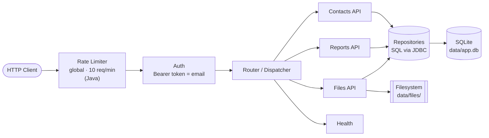

# CRM API Server

A compact, dual-language CRM API — the **same REST surface** implemented in both **Go** and **Java (Spring Boot)**, backed by SQLite. Manage contacts and files, export/report, and paginate through large datasets.


Both implementations share the same SQLite database schema and provide identical REST API endpoints.

---

## Table of Contents

- [Architecture](#architecture)
- [Documentation](#documentation)
- [Implementations](#implementations)
- [Quick Start](#quick-start)
- [Authentication](#authentication)
- [Rate Limiting](#rate-limiting)
- [Endpoints](#endpoints)
- [Pagination](#pagination)
- [Examples](#examples)
- [Testing](#testing)
- [Seeding Options](#seeding-options)
- [Benchmarks (Go only)](#benchmarks-go-only)
- [Configuration](#configuration)

---

## Architecture

Every request flows through a global rate limiter and bearer-token authentication before reaching a controller. Controllers persist through thin repositories to SQLite, while uploaded file bytes live on the local filesystem.



> The rate limiter is a **Java** feature (see [Rate Limiting](#rate-limiting)). For the full request lifecycle, startup sequence, and concurrency model — including the leaky-bucket internals — see the deep-dive docs below.

## Documentation

In-depth design docs for the Java implementation (each diagram renders on GitHub and has a rendered PNG under [`java/diagrams/`](java/diagrams/)):

| Document | What's inside |
|----------|---------------|
| [`java/REQUEST_LIFECYCLE.md`](java/REQUEST_LIFECYCLE.md) | Request lifecycle, startup/background runners, and the concurrency model — **5 Mermaid diagrams** |
| [`java/RATE_LIMITING.md`](java/RATE_LIMITING.md) | Leaky-bucket design notes: decisions, tradeoffs, alternatives considered, and future improvements |
| [`java/TESTING.md`](java/TESTING.md) | End-to-end testing guide + a ready-to-run Postman collection |

---

## Implementations

- **Go**: Located in `go/` directory
- **Java**: Located in `java/` directory (Spring Boot)

Both implementations share the same SQLite database schema and provide identical REST API endpoints.

## Quick Start

### Go

```bash
cd go
make seed   # Seed the database with test data
make run    # Start the server
```

Or without make:

```bash
cd go
go run ./cmd/server --seed
go run ./cmd/server
```

### Java

```bash
cd java
make seed   # Seed the database with test data
make run    # Start the server
```

Or without make:

```bash
cd java
./mvnw spring-boot:run -Dspring-boot.run.arguments="--app.seed=true"
./mvnw spring-boot:run
```

The server runs on `http://localhost:8080` by default.

## Authentication

All `/api/*` endpoints require a bearer token in the `Authorization` header:

```bash
curl -H "Authorization: Bearer user@example.com" http://localhost:8080/api/contacts
```

The token should be a valid email address. It serves as the user identifier.

## Rate Limiting

The **Java** server applies a **global, process-local rate limit** using a leaky
bucket algorithm: **10 requests per minute** shared across all clients (not
per-user). Requests beyond the limit receive `429 Too Many Requests` with a JSON
body:

```json
{"error":"rate limit exceeded"}
```

The limit is applied to every request before authentication, including `/health`.
Tune it with `app.rate-limit.requests-per-minute` in `application.properties`.

See [`java/RATE_LIMITING.md`](java/RATE_LIMITING.md) for design notes and
tradeoffs, and [`java/REQUEST_LIFECYCLE.md`](java/REQUEST_LIFECYCLE.md) for where
it fits in the request lifecycle (with rendered diagrams).

## Endpoints

### Health

| Method | Path | Description |
|--------|------|-------------|
| `GET` | `/health` | Health check (no auth required) |

### Contacts

| Method | Path | Description |
|--------|------|-------------|
| `GET` | `/api/contacts` | List contacts (paginated) |
| `GET` | `/api/contacts/:id` | Get a contact |
| `POST` | `/api/contacts` | Create a contact |
| `PUT` | `/api/contacts/:id` | Update a contact |
| `DELETE` | `/api/contacts/:id` | Delete a contact |
| `POST` | `/api/contacts/import` | Bulk import contacts (JSON array, max 10k) |
| `GET` | `/api/contacts/export` | Export all contacts as CSV |

### Files

| Method | Path | Description |
|--------|------|-------------|
| `GET` | `/api/files` | List files |
| `POST` | `/api/files` | Upload a file (multipart form, max 100MB) |
| `GET` | `/api/files/:id` | Download a file |

### Reports

| Method | Path | Description |
|--------|------|-------------|
| `GET` | `/api/reports/activity` | Activity report (last 30 days by default) |

## Pagination

The `/api/contacts` endpoint uses cursor-based pagination. The response includes a `next_page_token` field when more results are available:

```json
{
  "contacts": [...],
  "next_page_token": "eyJjcmVhdGVkX2F0Ijoi..."
}
```

Pass the token as a query parameter to fetch the next page:

```bash
curl -H "Authorization: Bearer user@example.com" \
  "http://localhost:8080/api/contacts?page_token=eyJjcmVhdGVkX2F0Ijoi..."
```

## Examples

```bash
# List contacts (first page)
curl -H "Authorization: Bearer user@example.com" \
  http://localhost:8080/api/contacts?limit=10

# Create a contact
curl -X POST -H "Authorization: Bearer user@example.com" \
  -H "Content-Type: application/json" \
  -d '{"first_name":"Jane","last_name":"Doe","email":"jane@example.com","phone":"555-1234","company":"Acme"}' \
  http://localhost:8080/api/contacts

# Upload a file
curl -X POST -H "Authorization: Bearer user@example.com" \
  -F "file=@/path/to/file.pdf" \
  http://localhost:8080/api/files

# Bulk import
curl -X POST -H "Authorization: Bearer user@example.com" \
  -H "Content-Type: application/json" \
  -d '[{"first_name":"A","last_name":"B","email":"a@b.com","phone":"555","company":"X"}]' \
  http://localhost:8080/api/contacts/import

# Export contacts
curl -H "Authorization: Bearer user@example.com" \
  http://localhost:8080/api/contacts/export > contacts.csv
```

## Testing

**Unit tests** (JUnit 5) exercise the rate limiter — both the leaky-bucket algorithm and the
servlet filter — at **100% line & branch coverage** (JaCoCo). No server needed:

```bash
cd java
./mvnw test        # 8 tests; coverage report at target/site/jacoco/index.html
```

- `LeakyBucketRateLimiterTest` — admit-to-capacity, reject overflow, config-driven capacity,
  steady leak, full recovery, idle clamping (deterministic via an injected clock — no sleeps).
- `RateLimitFilterTest` — admitted requests pass through; rejected ones return `429` + JSON.

A ready-to-run **Postman collection** lives in [`java/postman/`](java/postman/) — import
`CRM-API.postman_collection.json` + `CRM-API.postman_environment.json`. It covers the full
CRUD surface, a rate-limit burst (10×`200` then `429`), and the auth matrix (valid → `200`,
missing/bad → `401`).

See [`java/TESTING.md`](java/TESTING.md) for tight step-by-step instructions. Quick smoke
test of the rate limiter (run on a fresh bucket):

```bash
for i in $(seq 1 12); do
  curl -s -o /dev/null -w "#$i -> %{http_code}\n" http://localhost:8080/health
done
# → ten 200s, then 429
```

## Seeding Options

### Go

```bash
cd go
make seed                                      # Default: 10k contacts, 20 files
go run ./cmd/server --seed --contacts=50000    # Custom contact count
go run ./cmd/server --seed --files=100         # Custom file count
```

### Java

```bash
cd java
make seed                                                                              # Default: 10k contacts, 20 files
./mvnw spring-boot:run -Dspring-boot.run.arguments="--app.seed=true --contacts=50000"  # Custom contact count
```

To reset the database:

```bash
cd go && make reset   # Go
cd java && make reset # Java
```

## Benchmarks (Go only)

```bash
cd go
make bench
```

## Configuration

### Go

| Flag | Default | Description |
|------|---------|-------------|
| `--addr` | `:8080` | Server listen address |
| `--data` | `data` | Data directory for database and files |
| `--seed` | `false` | Seed database with test data |
| `--contacts` | `10000` | Number of contacts to seed |
| `--files` | `20` | Number of files to seed |

### Java

Configuration is in `src/main/resources/application.properties`:

| Property | Default | Description |
|----------|---------|-------------|
| `server.port` | `8080` | Server listen port |
| `app.data-dir` | `data` | Data directory for database and files |
| `app.max-upload-size` | `104857600` | Max file upload size (100MB) |
| `app.rate-limit.requests-per-minute` | `10` | Global leaky-bucket rate limit; excess requests get HTTP 429 |
