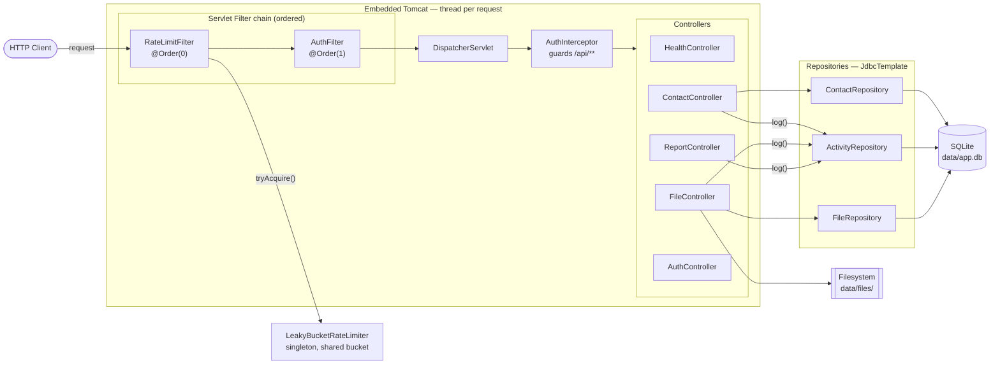
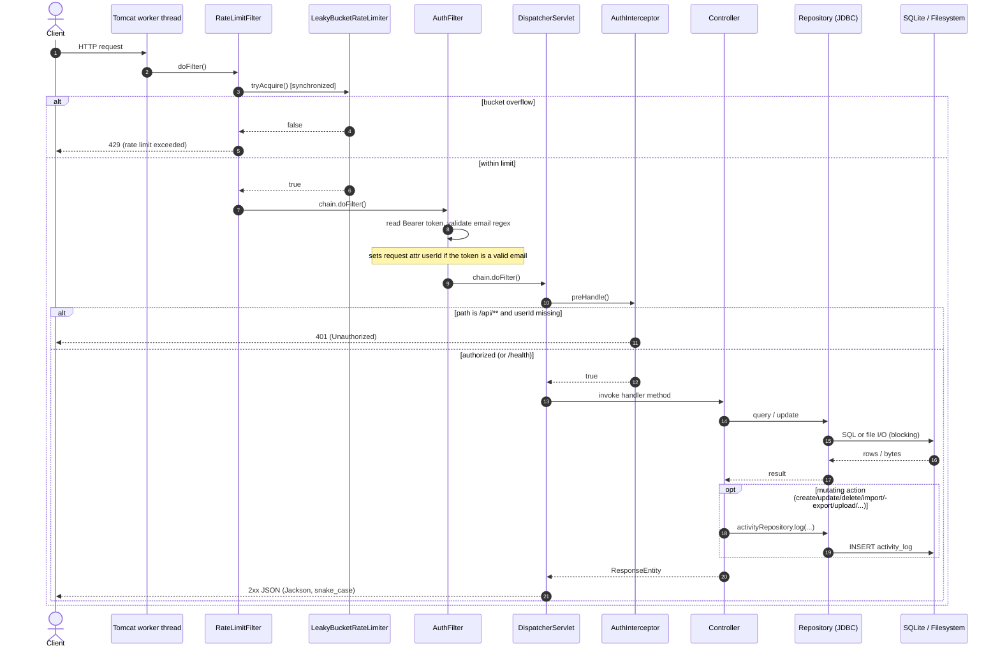
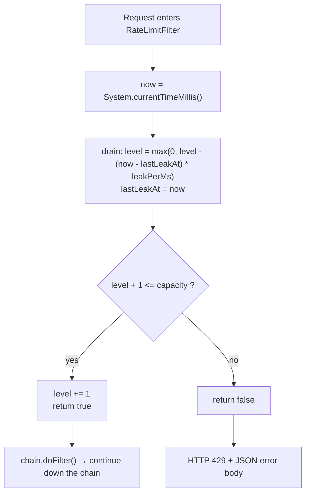
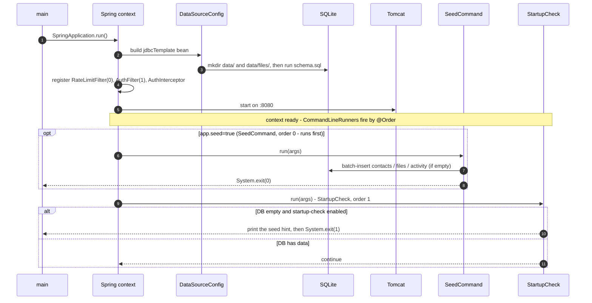
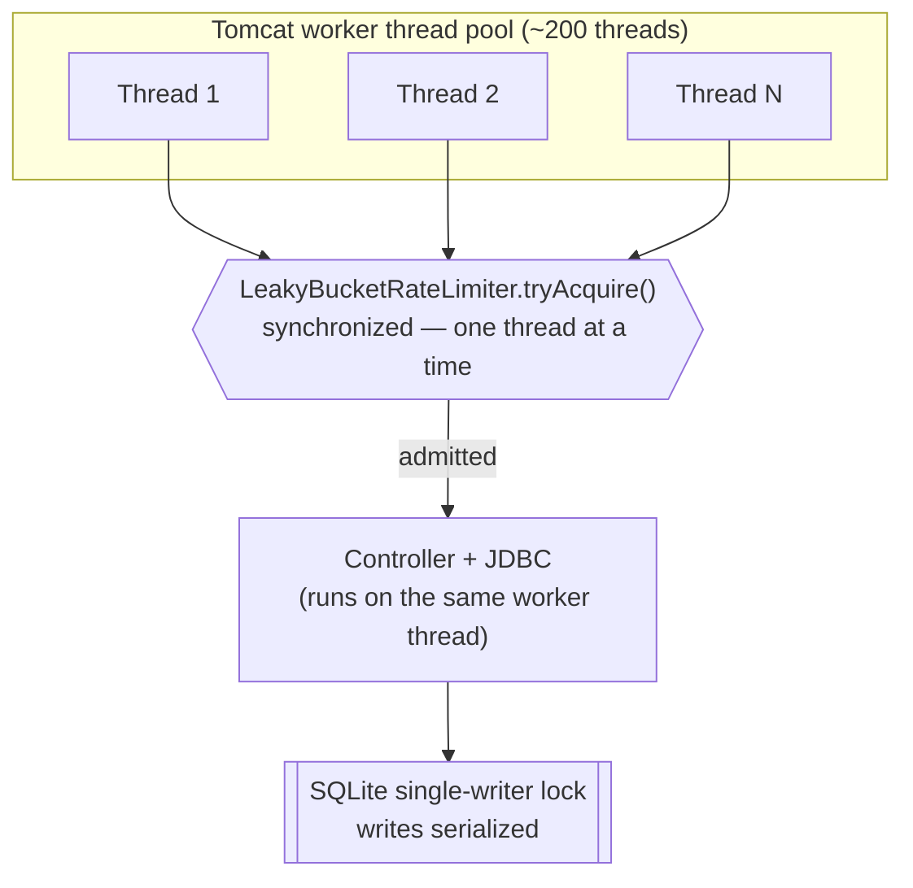

# Request Lifecycle & Flows (Java implementation)

End-to-end view of how a request travels through the Spring Boot server, how the
rate limiter fits in, and what the concurrency / background story is.

> Rendered PNGs of every diagram below live in [`java/diagrams/`](diagrams/).
> The fenced ` ```mermaid ` blocks also render directly on GitHub, in IntelliJ,
> and at <https://mermaid.live>.

## TL;DR — sync vs async

- **Per-request processing is fully synchronous / blocking.** One Tomcat worker
  thread carries a request from the first filter all the way to the JDBC/file I/O
  and back. There is no `@Async`, no `CompletableFuture`, no message queue, and no
  reactive/WebFlux — so "asynchronous" here does **not** mean offloaded request
  work.
- What *is* concurrent / background:
  - **Concurrency** — many requests run in parallel, each on its own worker
    thread, contending on the single `synchronized` rate-limiter bucket and on
    SQLite's single writer lock (Diagram 5).
  - **Background lifecycle** — `CommandLineRunner`s (`StartupCheck`, `SeedCommand`)
    run once at boot, independent of any request (Diagram 4).

---

## 1. System architecture (components & wiring)

How the pieces tie together and the direction data flows on the way in.



**Notes**
- The rate limiter is a single shared bean — the limit is *global*, not
  per-client. It is consulted in the very first filter, before auth.
- `/health` and `/api/auth/token` go through the same chain; only `/api/**` is
  gated by `AuthInterceptor`.

---

## 2. Synchronous request lifecycle (happy path + short-circuits)

The full life of a request on a single thread, including the two places it can be
cut short: **429** (rate limited) and **401** (unauthenticated `/api/**`).



**Key ordering fact:** rate limiting happens *before* authentication, so an
unauthenticated flood still counts against — and is stopped by — the global
limit.

---

## 3. Leaky-bucket decision (the algorithm)

What `LeakyBucketRateLimiter.tryAcquire()` does on each call. With
`app.rate-limit.requests-per-minute = 10`: `capacity = 10` and
`leakPerMs = 10 / 60000`, i.e. one unit drains every 6 seconds.



Behaviour: allows a **burst of up to 10**, then throttles to a **sustained 10 per
minute**; the bucket recovers continuously as time passes.

---

## 4. Startup & background lifecycle (runs once at boot)

These flows are independent of any HTTP request — the closest thing to
"asynchronous" work in the app.



> **Runner ordering (fixed in this work):** `SeedCommand` is `@Order(0)`, so it runs
> *before* `StartupCheck` (`@Order(1)`). With `--app.seed=true` (i.e. `make seed`) the
> seeder populates a fresh DB and exits `0` before `StartupCheck` runs; `StartupCheck`
> only trips (prints a hint, then `System.exit(1)`) when you start *without* seeding
> against an empty DB. Previously the reverse order let `StartupCheck` exit before the
> seeder ever ran, so `make seed` silently failed on a fresh database.

---

## 5. Concurrency model (parallel requests, shared state)

Where actual parallelism lives, and the two serialization points.



**Takeaways**
- Parallelism = multiple worker threads, not async offloading. Each admitted
  request is handled start-to-finish on its own thread.
- Two serialization points under load: the `synchronized` bucket (tiny critical
  section) and SQLite's single-writer lock (writes are serialized; reads can
  overlap).
- Ideas to make the concurrent/limiter design more robust are in
  [`RATE_LIMITING.md`](RATE_LIMITING.md).
